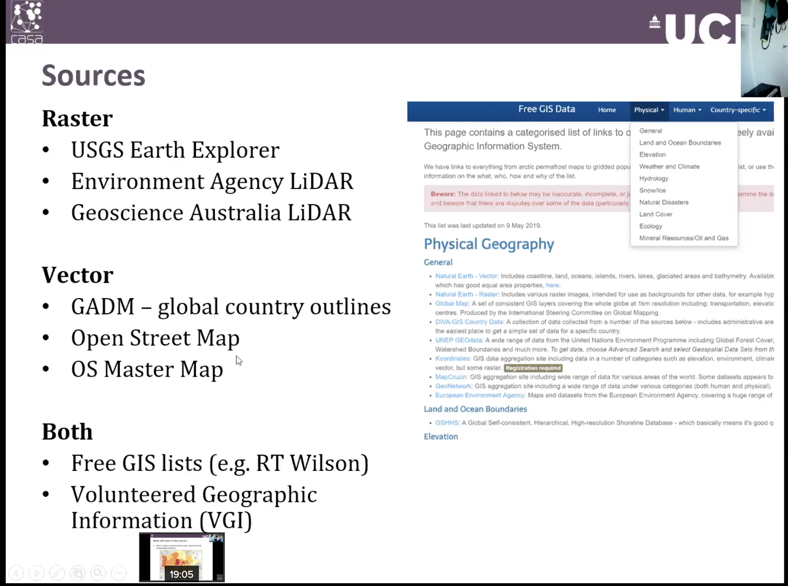

# CASA0005
This repo will contain the .Rmd file and .R file with the goal of GIScience final assessment.

# Inspiration

The cartographic and GIScience topic

1.  Emotional cartographic: depression disturbtion temporal and spatial rules 
    - refer to the second assignment
    - Dataset:...

2. Analysis of female empolyment before and after covid-19
    - Dataset: Linkedin

3. Beer geographic
    
4. Uder things (It is from Zhengzi)
    - [Uber Analytics](https://github.com/uber/h3-py-notebooks/blob/master/notebooks/urban_analytics.ipynb)
    - [OSD Road Network Analysis](https://github.com/gboeing/osmnx-examples/blob/master/notebooks/09-example-figure-ground.ipynb)

5. The analysis of coffee shop
    - inspired via my undergrad projekt e-commerce work
    - distrubtion of cafe
    - in other perspectives, we can also analyse the Yelp/TripAdvisor restaurant/cafe

6. Disability equipment location in London, UK

7. [Coursera AI Global Skills Index 2019 data](https://www.kaggle.com/parulpandey/coursera-ai-global-skills-index-2019-data)
    - [Amazon](https://www.kaggle.com/atahmasb/amazon-job-skills)
    - [Google](https://www.kaggle.com/niyamatalmass/google-job-skills)

8. 新能源充电桩 EV charging

    - [Dataset](https://www.gov.uk/guidance/find-and-use-data-on-public-electric-vehicle-chargepoints#accessing-data-on-ncr)
    - []

# Inspiration to Reality

One problem:

How can I find the relationship between EV charging location and another factor?
    - CO2 emission
    - 

# Data Source

（mentioned in wk1 CASA0005 lecture）

- [PlanB: New York City Airbnb Open Data](https://www.kaggle.com/dgomonov/new-york-city-airbnb-open-data/metadata)

